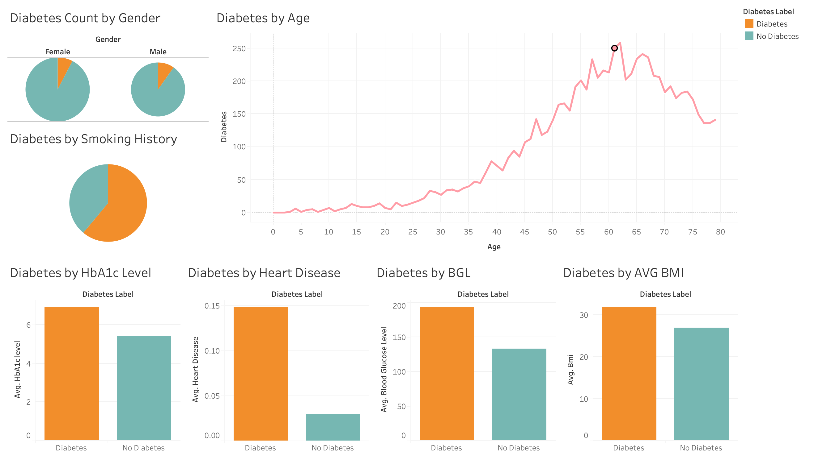
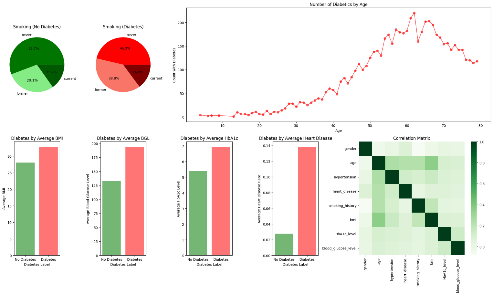
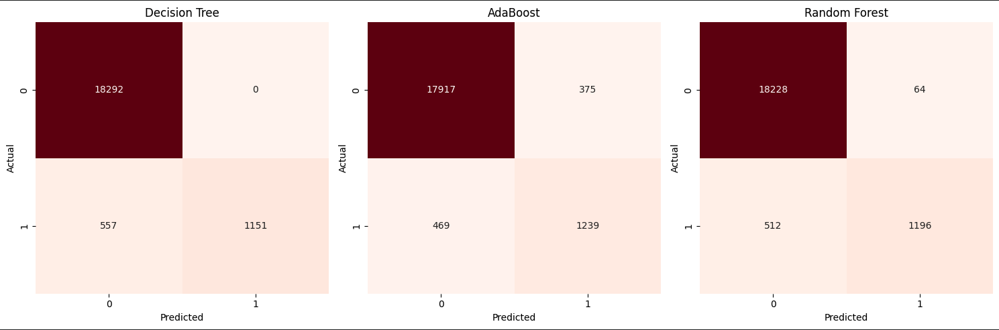
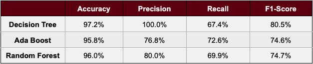
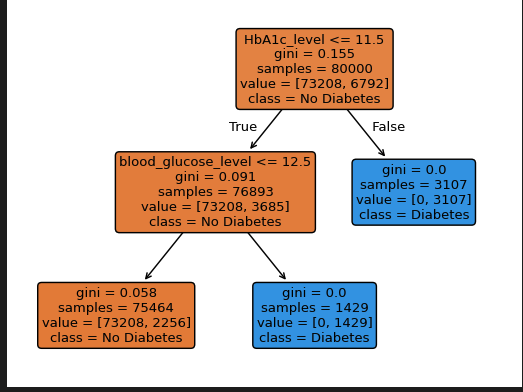
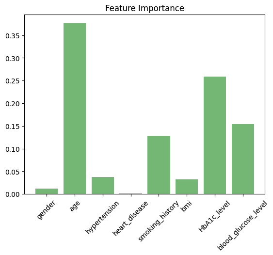
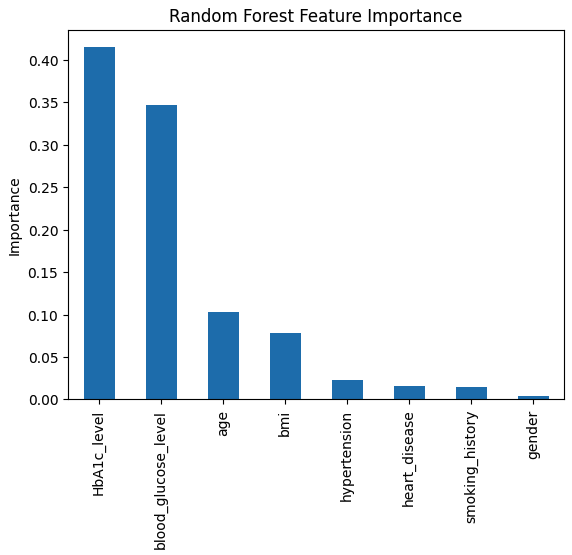

# DiabetesClassificationDataMiningProject

## Platform

To run this program, open in Google Colab and run each cell in order.

## Technologies Used

Python (NumPy, Pandas, Scikit-Learn, Matplotlib, Seaborn), Tableau

## Executive Overview

This project analyzes key health factors associated with diabetes using a dataset of 100,000 patient records. The goal is to identify the most influential predictors of diabetes and support accurate classification through machine learning models.

The results highlight HbA1c levels and blood glucose levels as the strongest indicators of diabetes, showing a clear and consistent relationship with positive diagnoses. Additional factors such as age, BMI, hypertension, and smoking history also contribute to increased risk, though to a lesser extent.

Overall, the analysis demonstrates that diabetes classification is primarily driven by glucose-related measures, with other health and lifestyle factors providing supporting context in predicting risk.

## Dataset and Problem Defintion

For this project, a dataset of 100,000 patients' medical records was used to predict if a patient had been diagnosed with diabetes or not. The objective of this classification was to identify key medical factors associated with the development and diagnosis of diabetes and use them to build an accurate predictive model using Decision Trees and AdaBoost. Medical factors in the dataset include: Smoking History, HbA1c Level, BMI, Blood Glucose Level, Heart Disease, Hypertension, Age, and Gender. 

## Tableau Dashboard

## EDA

Figure 2

Data Evaluation and Analysis

Smoking insights show that those who have a medical history of smoking have a slightly larger share of diabetes diagnoses compared to those who don’t; although, the ratio between smokers and non-smokers is within 10% among both diabetes and non-diabetes patients. This data was shown as a pie chart, sufficiently visualizing the proportion of smokers and non-smokers between diabetes and non-diabetes patients. 

For all medical factors compared by averages between diabetes and non-diabetes patients, a positive correlation is found in elevated average BMI, Blood Glucose Levels, HbA1c Levels with the diagnosis of diabetes. This positive correlation also applies to heart disease patients with the most significant difference among the two populations. These comparisons were visualized as bar charts to compare the difference of average values between the two populations in each medical factor, adequately showing the positive correlation between higher values and diabetes diagnoses.

A positive correlation with older age was also found in plotting the count of diabetes patients at each age. Analyzing the line plot shows that diabetes diagnoses started increasing steadily after the age of 35, peaking between the ages of 60 and 70, with mortality as the most potential reason for the drop in diagnoses after 70.

The correlation matrix indicates that most medical factors show weak or insignificant relationships; however, several variables exhibit meaningful correlations with age, supporting the trend observed in the analysis line graph of the number of diabetics by age.

## Classification Models

Figure 3

Decision Tree, AdaBoost, and Random Forest Confusion Matrices

Note. These numbers are measured as the count of each observed category.

Figure 4

Model evaluation scores of each model: Decision Tree, AdaBoost, Random Forest

Analyzing Figure 3 and Figure 4, results from each model has its own evaluation advantage within the spread of all model scores. 

For precision-oriented evaluation, the Decision Tree demonstrates a conservative classification behavior, avoiding false positives shown by its 100% precision. This shows that all aggressively positive cases were correctly identified via the thresholds in Figure 5. However, this comes at the cost of lower recall, suggesting that some true positive cases were missed. The model achieves the highest accuracy, which is influenced in part by the class imbalance in the dataset, where 90.6% of observations are non-diabetic patients. This imbalance can inflate accuracy, as correctly predicting the majority class contributes heavily to the metric. Additionally, the Decision Tree has the highest F1-score among all the models, reflecting a strong balance between precision and recall, although this balance is primarily driven by its high precision and less than adequate recall rates.

Figure 5

Printed Decision Tree classifier

Note. HbA1c was measured as a percentage (%) of glycated hemoglobin, reflecting average blood glucose levels over the past 2–3 months. Blood Glucose Level was measured as mmol/L.

For recall-oriented evaluation, AdaBoost achieves the highest recall among the models, indicating high efficiency in identifying positive cases. In medical classification, recall is particularly important, as missing a positive diagnosis can be more harmful than assigning a false negative diagnosis. As a result, AdaBoost may be better suited for detecting less obvious diabetes cases than the Decision Tree model, as it prioritizes capturing true positives while considering multiple contributing features (see Figure 6).

Figure 6

AdaBoost Feature Importance

Note. Feature importance scores are expressed as normalized decimal values summing to 1, where each value represents the proportion of total importance attributed to a feature. Multiplying by 100 converts these proportions into percentages for clearer interpretation.

Random Forest provides the most balanced classification, achieving moderate precision and recall without the extremes shown in the Decision Tree or Ada Boost models. With Random Forest aggregating multiple trees, it reduces variance and prevents overfitting, resulting in stable performance (see Figure 7). These feature importance levels recorded correlate directly with those found in the AdaBoost model. Although individual metrics are lower than Decision Tree and AdaBoost models, its consistency makes it best suited for prioritized generalization and reliability over a single performance metric.

Figure 7

Random Forest Feature Importance

Note. Feature importance scores are expressed as normalized decimal values summing to 1, where each value represents the proportion of total importance attributed to a feature. Multiplying by 100 converts these proportions into percentages for clearer interpretation.

## Insights

Based on the collective results of the models, it’s consistently indicated that elevated HbA1c and Blood Glucose levels are the most significant factors to diabetes diagnoses across all models. This aligns with established medical understanding, where elevated HbA1c and glucose levels are key factors in diabetes diagnoses. Additionally, the age analysis suggests that risk begins to increase in the 30–40 age range, indicating that earlier monitoring in this age range could improve detection of at-risk individuals. A smaller, yet meaningful, association is observed between higher BMI and diabetes diagnoses, suggesting that BMI acts as an additional risk factor alongside elevated HbA1c and blood glucose levels.

Class imbalance presents a significant limitation across all models, as 90.6% of the dataset consists of non-diabetic patients. This imbalance inflates accuracy, since a model could predict every patient as non-diabetic and still achieve 90.6% accuracy. As a result, performance on the minority class is less accurately reflected, increasing the risk of missed positive diagnoses.

The effects of this imbalance are evident in the Decision Tree model. While it achieves a precision score of 100%, this shows the model tends to favor non-diabetic cases and avoids making uncertain predictions, reducing false positives but lowering recall and leading to missed diabetic cases.
Ensemble models are less affected by class imbalance, as reflected in their more balanced evaluation metrics. AdaBoost achieves higher recall, improving its ability to detect positive cases, but does so at the cost of lower precision and an increase in false positives. Random Forest demonstrates the most consistent balance between precision and recall, providing more stable overall performance, although it does not outperform other models in any single metric.

Overall, AdaBoost is the most appropriate model for diabetes classification due to its superior recall compared to the other models. In medical classification, recall is the most important evaluation metric, as failing to identify a positive case can have more serious consequences than incorrectly predicting a false positive. By prioritizing the reduction of false negatives, AdaBoost is better suited for identifying at-risk patients, even if this results in a higher number of false positives. Therefore, since it identifies more true positive patients, it is the most appropriate model for this application.

## Conclusion and Future Work
The findings of our models and analysis indicate that elevated HbA1c and blood glucose levels, as well as older age and higher BMI, are key predictors of diabetes diagnosis classification. Emphasis on recall in identifying positive cases makes AdaBoost the most appropriate model for medical diagnosis tasks. Future improvements address class imbalance by using resampling techniques to better balance the distribution of diabetic and non-diabetic cases. By addressing this imbalance, the model would improve its performance by being trained on a more balanced distribution of diabetic and non-diabetic patients, encouraging the model to better learn patterns associated with the minority class (diabetics) and improving its ability to correctly identify positive diagnoses while reducing the probability of missed diagnoses.

